# Swift Concurrency: The Formal Requirements, the Features That Serve Them, and Whether the Whole Thing Is Consistent

**A synthesis whitepaper** · Draft 1.0 · 2026-07-05 · compiled by Jonathan Gilbert

**Scope:** Swift 5.5 through Swift 6.4 (beta), all accepted Swift Evolution concurrency proposals, both vision documents, official documentation, and the compiler-internals discussions surrounding the currently open soundness holes.

**Motivating incident:** [Which subsystem is responsible for preventing this concurrency bug?](https://forums.swift.org/t/which-subsystem-is-responsible-for-preventing-this-concurrency-bug/88002) (forums.swift.org, July 2026)

> **Status disclaimer.** This is a reconstruction. No normative document of this kind is published by the Swift project; every requirement below is synthesized from proposals, vision documents, and code, with citations. Where a requirement is my inference rather than a stated commitment, it is flagged **[inferred]**. Where the sources contradict each other, the contradiction is the point, and it is discussed in §6.

---

## Table of contents

- [§0 Executive summary](#0-executive-summary)
- [§1 Prior art: why this document did not already exist](#1-prior-art-why-this-document-did-not-already-exist)
- [§2 The requirements](#2-the-requirements)
- [§3 The intended theorem: data-race freedom](#3-the-intended-theorem-data-race-freedom)
- [§4 Feature-to-requirement mapping: every keyword, type, attribute, and macro](#4-feature-to-requirement-mapping)
- [§5 The enforcement architecture: who checks what](#5-the-enforcement-architecture-who-checks-what)
- [§6 Consistency and satisfiability analysis](#6-consistency-and-satisfiability-analysis)
- [§7 Constructive criticism: how to make it consistent](#7-constructive-criticism-how-to-make-it-consistent)
- [§8 Coexistence with preconcurrency: Thread, GCD, locks](#8-coexistence-with-preconcurrency-thread-gcd-locks)
- [Appendix A: Complete accepted-proposal index](#appendix-a-complete-accepted-proposal-index)
- [Appendix B: Catalog of known soundness holes](#appendix-b-catalog-of-known-soundness-holes)
- [Appendix C: Glossary](#appendix-c-glossary)
- [Appendix D: Sources](#appendix-d-sources)

---

## §0 Executive summary

Swift concurrency is governed by roughly two dozen requirements, of which one is the cornerstone for all the others:

> **R-SAFE-1.** A program that type-checks in the Swift 6 language mode and uses no unsafe opt-outs has no data races.

Everything else — actors, `Sendable`, regions, `sending`, executors, structured tasks — exists either to make R-SAFE-1 true or to make it bearable (the "approachability" meta-requirements). The findings of this paper:

1. **The requirement set is consistent at the semantic level.** A mathematical model exists: the region calculus of SE-0414 is an adaptation of a published, proved-sound type system (Milano, Turcotti & Myers, *A Flexible Type System for Fearless Concurrency*, PLDI 2022), layered on the actor serialization model and the C/C++ happens-before memory model adopted by SE-0282. There is no inherent contradiction in what Swift promises. (§6.1)

2. **The implementation is not currently a model of the requirements.** At least nine distinct, acknowledged soundness holes exist as of July 2026 (Appendix B). These are not random bugs: almost all of them cluster at one architectural touchpoint — the unwritten hand-off contract between the type checker (Sema) and the SIL-level region analysis (RBI). (§6.2, §6.4)

3. **The touchpoint is unwritten.** Sema deliberately permits conversions that erase actor isolation from function types, on a soundness premise recorded only in a 2022 pull-request description: *"if we prevent the value from later leaving that isolation domain, it's OK to simply drop the global-actor."* Two years later, SE-0430's `sending` created a new way for values to leave isolation domains, and no artifact existed that would have forced anyone to re-validate the premise. The motivating bug of this paper is exactly that: each layer believes the other owns the check. This is a specification gap, not merely an implementation bug. (§6.2)

4. **Three meta-requirements — soundness, minimal annotations, and modular checking — are jointly satisfiable but only barely**, and the tension between them is the generative source of the carve-outs and heuristics where the holes live. (§6.3)

5. **It can be made consistent.** §7 proposes concrete, mostly incremental steps: a normative semantics document with requirement IDs; a single-owner rule for every judgment; an explicit SIL-level invariant ("no isolation erasure without region tagging") that mechanically subsumes the current hole family; an executable litmus-test suite; and a longer-term type-system direction that removes isolation-erasing conversions altogether.

The paper also gives the formal reading of every concurrency language feature (§4), copious diagrams throughout, and a full account of how the model coexists with threads, GCD, and locks (§8).

---

## §1 Prior art: why this document did not already exist

You asked first whether this document already exists. It does not. What exists is a set of partial views, each of which was checked in the course of writing this:

| Artifact | What it is | What it is not |
|---|---|---|
| [TSPL "Concurrency" chapter](https://docs.swift.org/swift-book/documentation/the-swift-programming-language/concurrency/) | Narrative tutorial semantics | Not normative, no requirements, no enforcement model |
| [Swift Concurrency Proposal Index](https://developer.apple.com/forums/thread/768776) (Quinn, Apple DTS; rev. 2026-02) | The best existing inventory of proposals | A list, not a semantics; explicitly stops at Swift 6.2 |
| [Swift Concurrency Roadmap](https://forums.swift.org/t/swift-concurrency-roadmap/41611) (2020) | The original goal statement | Predates nearly everything; several plans changed |
| [Approachable data-race safety vision](https://github.com/swiftlang/swift-evolution/blob/main/visions/approachable-concurrency.md) (2025) | The best statement of meta-requirements | Directional; explicitly not a specification |
| [SE-0414 + appendix](https://github.com/swiftlang/swift-evolution/blob/main/proposals/0414-region-based-isolation.md) | The only genuinely formal fragment (region dataflow) | Covers one subsystem; silent on its interface to Sema |
| [Swift 6 migration guide](https://www.swift.org/migration/documentation/migrationguide/) | Operational how-to | Not a semantics |
| [Massicotte's concurrency glossary](https://www.massicotte.org/concurrency-glossary/) | Community vocabulary | Definitions, not requirements |
| [Swift Concurrency Manifesto](https://gist.github.com/lattner/31ed37682ef1576b16bca1432ea9f782) (Lattner, 2017) | Historical ancestor | Substantially superseded |

No artifact states the requirements as requirements, maps features to them, assigns each check an owner, or asks whether the set is consistent. The absence of the third item — an owner per check — is precisely what forum thread 88002 is asking about, and as of the date of this paper that thread (and its more detailed sibling, [thread 87519](https://forums.swift.org/t/rbi-failure-to-diagnose-invalid-use-after-sends-permits-data-race-safety-holes/87519)) has zero replies.

---

## §2 The requirements

### §2.1 Notation and primitive concepts

The definitions below are the vocabulary the requirements are stated in. Sources: SE-0296, SE-0304, SE-0306, SE-0392, SE-0414, and the 2020 roadmap glossary.

- **Job (partial task).** The unit of schedulable work: a maximal run of an async function between suspension points. Jobs are what executors run.
- **Task.** An ordered sequence of jobs representing one logical thread of asynchronous control flow. Tasks form a tree (structured concurrency): child tasks are created by `async let`, task groups, or implicitly, and are bounded by their parent's scope. Unstructured tasks (`Task {}`, `Task.detached {}`) are roots.
- **Executor.** A service that accepts jobs and runs them. A serial executor additionally guarantees mutual exclusion and a total order over its jobs (SE-0392).
- **Isolation domain.** A protection boundary for mutable state. The set of domains is:
  - one domain per actor instance;
  - one domain per global actor type (e.g. `MainActor`);
  - the **task-isolated** context of a specific task's non-shared values;
  - **`nonisolated`** — the absence of protection: no domain, no serialization guarantee.
- **Static isolation** `ι(d)`. Every declaration `d` has exactly one static isolation: an actor instance (via `isolated` parameter or `self` of an actor), a global actor, caller-inherited (`nonisolated(nonsending)`, `isolated` parameter defaulted to `#isolation`), or `nonisolated`.
- **Suspension point.** A syntactically marked (`await`) program point where a task may relinquish its executor. Between suspension points, a job runs without interleaving within its domain.
- **Sendable type.** A type whose values can be freely copied/referenced across domain boundaries without creating shared mutable state (SE-0302).
- **Isolation region (SE-0414).** An equivalence class over non-`Sendable` values closed under aliasing and reachability: if `x` can reach or alias `y`, they are in one region. Each region has a status: disconnected (owned by the current context, transferable), **actor-isolated**, **task-isolated**, or **sent/consumed**.
- **Crossing.** A value crosses a boundary when it is passed to, returned from, or captured by code whose isolation differs from the current context.

The domain landscape:

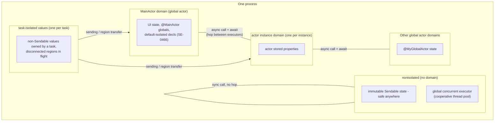

### §2.2 Memory-model axioms (R-MEM)

These predate async/await and are the substrate everything sits on.

> **R-MEM-1 (Law of Exclusivity).** Two accesses to the same variable conflict unless both are reads; conflicting accesses must not overlap in time. Enforced statically where possible, dynamically (or by UB for unsafe pointers) otherwise. — [SE-0176](https://github.com/swiftlang/swift-evolution/blob/main/proposals/0176-enforce-exclusive-access-to-memory.md)

> **R-MEM-2 (Memory consistency model).** Swift adopts the C/C++ memory model: a data race is a pair of conflicting, non-atomic accesses unordered by *happens-before*; a program with a data race has undefined behavior. — [SE-0282](https://github.com/swiftlang/swift-evolution/blob/main/proposals/0282-atomics.md), [SE-0410](https://github.com/swiftlang/swift-evolution/blob/main/proposals/0410-atomics.md)

R-MEM-2 is what makes R-SAFE-1 meaningful: "no data races" is defined as "all conflicting access pairs are happens-before ordered."

### §2.3 The core safety requirement (R-SAFE)

> **R-SAFE-1 (Data-race freedom).** If a program type-checks under complete concurrency checking (Swift 6 language mode) and uses none of the unsafe opt-outs (§2.10), it contains no data races in the R-MEM-2 sense. — Roadmap: *"eliminate data races and deadlocks in the same way Swift eliminates memory unsafety"*; vision doc: *"extend Swift's memory safety guarantees to low-level data races."*

> **R-SAFE-2 (Safety is static-first).** The guarantee is delivered at compile time by default; dynamic enforcement (traps) is reserved for boundaries with unchecked code (§2.8) and programmer assertions. **[inferred** from the design of SE-0414/SE-0430 vs. SE-0423**]**

> **R-SAFE-3 (No deadlock by construction, weak form).** The language primitives do not introduce deadlocks: actors are re-entrant at suspension points precisely so that awaiting into an actor cannot deadlock (SE-0306, "Actor reentrancy"). The price is that actor invariants must be re-established before every `await`. Note the requirement is deliberately weak: user-level logical deadlocks (e.g. blocking a cooperative thread, §8.2) are not prevented.

### §2.4 Isolation requirements (R-ISO)

> **R-ISO-1 (Total isolation assignment).** Every declaration has exactly one static isolation, determined by explicit annotation, inference (conformances, overrides, enclosing type, module default per SE-0466), or defaulting rules. There is no "sometimes isolated" declaration; polymorphism over isolation is explicit (`isolated` parameters, `@isolated(any)`, `nonisolated(nonsending)`). — SE-0306, SE-0313, SE-0316, SE-0420, SE-0431, SE-0461, SE-0466

> **R-ISO-2 (Domain access rule).** Code may synchronously access state isolated to domain `D` only if its own isolation is `D`. Cross-domain access requires an asynchronous call (a hop onto `D`'s executor) — with the single exception of reading immutable `Sendable` (`let`) storage. — SE-0306

> **R-ISO-3 (Serialization).** For every domain with a serial executor, all jobs isolated to that domain are mutually excluded and totally ordered by the executor. A custom executor supplying `unownedExecutor` assumes this obligation (it is a proof obligation on the implementor, unchecked by the compiler). — SE-0306, SE-0392

> **R-ISO-4 (Suspension-point atomicity).** Between two suspension points, an isolated function's access to its domain's state is not interleaved with any other code of that domain. Corollary: every `await` is a potential interleaving point, and actor invariants must hold at every `await`. — SE-0296, SE-0306

> **R-ISO-5 (Executor correspondence).** SILGen inserts executor hops so that, dynamically, code always runs on the executor of its static isolation: on entry to an isolated function and on every resume from suspension. Static isolation and dynamic executor must never disagree in safe code. **[inferred** — this is the invariant the runtime checks of SE-0392/SE-0424/SE-0471 probe, and whose violation in the Swift 6.3.2 miscompile ([#88993](https://github.com/swiftlang/swift/issues/88993)) was treated as a critical bug**]**

> **R-ISO-6 (Isolation of ancillary code).** Code that runs implicitly on behalf of a declaration — default-argument expressions, stored-property initializers (SE-0411), `defer` bodies (SE-0493), `deinit` if declared `isolated` (SE-0371), actor `init`/`deinit` flow-sensitive phases (SE-0327) — carries a defined isolation; nothing executes in an unspecified domain.

> **R-ISO-7 (Conformance isolation).** A protocol conformance is itself a value-like fact that can carry isolation; an isolated conformance may only be used where that isolation is guaranteed, and generic code that could move the conformance across domains (via `SendableMetatype` capability) must be prevented from using it. — [SE-0470](https://github.com/swiftlang/swift-evolution/blob/main/proposals/0470-isolated-conformances.md)

### §2.5 Boundary-crossing requirements (R-SEND)

This is the heart of the system, and the site of the motivating bug.

> **R-SEND-1 (Sendable crossing).** A value may cross an isolation boundary if its type is `Sendable`. `Sendable` conformance is structurally checked: all stored state Sendable; classes additionally final with immutable state (or `@unchecked`). `@Sendable` function values capture only Sendable values, by value. — [SE-0302](https://github.com/swiftlang/swift-evolution/blob/main/proposals/0302-concurrent-value-and-concurrent-closures.md)

> **R-SEND-2 (Region crossing).** A non-`Sendable` value may cross a boundary iff its entire isolation region is disconnected from the origin domain at the crossing point; the crossing transfers the whole region, after which any use of any value of that region from the origin is an error. Merging a region into an actor's domain is permanent. — [SE-0414](https://github.com/swiftlang/swift-evolution/blob/main/proposals/0414-region-based-isolation.md)

> **R-SEND-3 (`sending` obligations).** A `sending` parameter is a caller obligation (argument must be in a disconnected region at the call site) conferring a callee right (may merge the value into any domain, including sending it again). A `sending` result is the mirror image. — [SE-0430](https://github.com/swiftlang/swift-evolution/blob/main/proposals/0430-transferring-parameters-and-results.md)

> **R-SEND-4 (Conservative merge).** When the checker cannot prove separation, it must merge regions (assume any argument of a call may become reachable from any other). Unsoundness is never the permitted resolution of uncertainty; false positives are. — SE-0414 merge rules

> **R-SEND-5 (Isolation fidelity of values).** The static isolation attributed to a value (especially a function value) must remain a sound description of what the value does at runtime, under every conversion, capture, and erasure the type system permits. A function value that will execute `@MainActor`-isolated code must not be usable as evidence that no isolation is involved. **[inferred** — never stated anywhere, but it is the premise on which both Sema's conversion rules and RBI's region classification silently rely; the motivating bug of this paper is a violation of exactly this requirement. See §6.2.**]**

Region lifecycle:

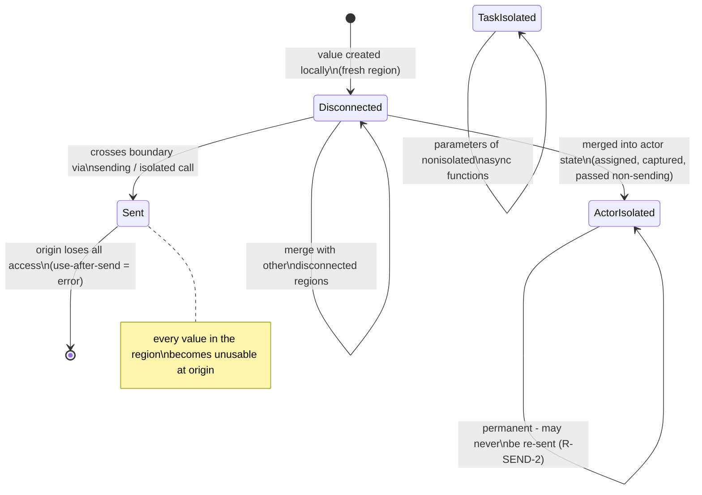

### §2.6 Structured-concurrency requirements (R-STRUCT)

> **R-STRUCT-1 (Tree-bounded lifetime).** A child task cannot outlive the scope that created it: scope exit awaits (or cancels-then-awaits) all children. `async let` children not awaited on some path are implicitly cancelled and awaited. — [SE-0304](https://github.com/swiftlang/swift-evolution/blob/main/proposals/0304-structured-concurrency.md), [SE-0317](https://github.com/swiftlang/swift-evolution/blob/main/proposals/0317-async-let.md)

> **R-STRUCT-2 (Cooperative cancellation).** Cancellation is a monotonic flag propagated down the task tree; it never preempts, never injects failures, and is observed voluntarily (`Task.isCancelled`, `checkCancellation`, cancellation handlers). Since SE-0504, observation of the flag can be locally shielded, but the flag itself remains monotonic and externally visible. — SE-0304, [SE-0504](https://github.com/swiftlang/swift-evolution/blob/main/proposals/0504-task-cancellation-shields.md)

> **R-STRUCT-3 (Priority propagation and escalation).** Child tasks inherit priority; awaiting a task from a higher-priority context escalates the awaited task (and, transitively, what it runs on). Exposed to user code by SE-0462. — SE-0304

> **R-STRUCT-4 (Context inheritance).** Structured children and `Task {}` inherit task-locals (SE-0311), priority, and — for `Task {}` — the enclosing actor isolation (formalized by `@isolated(any)` capture, SE-0431). `Task.detached` inherits none of these.

> **R-STRUCT-5 (Continuation discipline).** Every continuation is resumed exactly once. Checked continuations trap on double-resume and diagnose leaks; unsafe continuations make the same rule UB. This is the formal boundary condition for bridging unstructured/legacy code into the task world. — [SE-0300](https://github.com/swiftlang/swift-evolution/blob/main/proposals/0300-continuation.md)

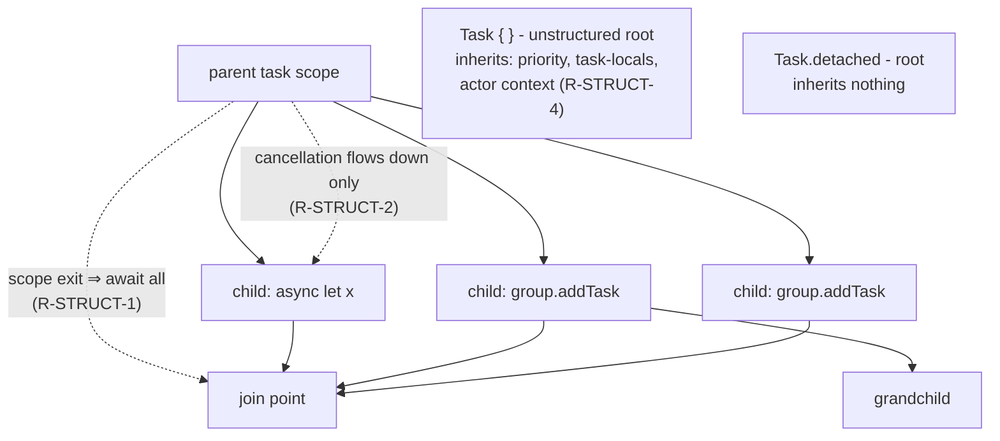

### §2.7 Runtime and scheduling requirements (R-RUN)

> **R-RUN-1 (Forward progress / non-blocking pool).** The default runtime is a cooperative thread pool with ~one thread per core. Code running on it must always make forward progress: it must never block a pool thread waiting on future work of the same pool (semaphores, condition variables, or blocking joins across task dependencies are contract violations; short, bounded lock hold-times are permitted). Violations risk deadlock, not just slowness, because the pool does not grow to cover blocked threads. — WWDC21 ["Swift concurrency: Behind the scenes"](https://developer.apple.com/videos/play/wwdc2021/10254/)

> **R-RUN-2 (Suspension is cheap and cooperative).** Suspension stores the job's frame on the heap and frees the thread; threads are never held across a suspension point. Await is a scheduling event, not a blocking event.

> **R-RUN-3 (Executor semantics floor).** Serial executors provide mutual exclusion + total order (R-ISO-3) but not FIFO; the default actor executor is priority-aware and supports escalation. Programs must not depend on FIFO ordering of actor mailboxes. Task ordering beyond happens-before is explicitly out of scope (vision doc).

> **R-RUN-4 (Dynamic isolation checkability).** The runtime can answer "am I in domain D?" (`assertIsolated`, `preconditionIsolated`, `assumeIsolated`, `checkIsolation()`/`isIsolatingCurrentContext()` for custom executors). `assumeIsolated` converts a dynamic proof into static isolation for a scope, trapping if the assumption is false. — SE-0392, SE-0424, SE-0471

### §2.8 Interop and bridging requirements (R-BRIDGE)

> **R-BRIDGE-1 (ObjC async import).** ObjC completion-handler methods import as `async` functions; the exactly-once handler convention maps to exactly-once return/throw. — SE-0297

> **R-BRIDGE-2 (Pessimistic import of unchecked callables).** Completion-handler parameters imported from ObjC are `@Sendable` by default, because the platform may invoke them on any queue. Unchecked code is assumed hostile until annotated. — [SE-0463](https://github.com/swiftlang/swift-evolution/blob/main/proposals/0463-sendable-completion-handlers.md)

> **R-BRIDGE-3 (`@preconcurrency` boundary semantics).** Concurrency checking degrades gracefully at module boundaries with unchecked code: diagnostics are downgraded/suppressed for `@preconcurrency` imports, and declarations vended `@preconcurrency` keep working for pre-strict clients. — [SE-0337](https://github.com/swiftlang/swift-evolution/blob/main/proposals/0337-support-incremental-migration-to-concurrency-checking.md)

> **R-BRIDGE-4 (Trap, don't race, at trust boundaries).** Where static checking was waived (e.g. `@preconcurrency` conformances), the compiler inserts dynamic isolation assertions so that a violated assumption becomes a deterministic trap instead of a silent race. — [SE-0423](https://github.com/swiftlang/swift-evolution/blob/main/proposals/0423-dynamic-actor-isolation.md)

> **R-BRIDGE-5 (Thread-affine APIs are quarantined).** APIs whose meaning depends on thread identity can be marked `@available(*, noasync)` and are then unusable across suspension points. — [SE-0340](https://github.com/swiftlang/swift-evolution/blob/main/proposals/0340-swift-noasync.md)

### §2.9 Meta-requirements (R-META)

These are requirements about the system, stated in the two vision documents. They constrain the solution space as hard as the technical requirements do — and they are the source of most tension (§6.3).

> **R-META-1 (Progressive disclosure).** Sequential, single-threaded programs must compile without encountering concurrency diagnostics at all; using `async/await` without parallelism must not force confrontation with data-race safety; only explicit parallelism may surface the full machinery. — [Approachable-concurrency vision](https://github.com/swiftlang/swift-evolution/blob/main/visions/approachable-concurrency.md)

> **R-META-2 (Minimal annotation burden).** "Drastically reduce the number of explicit concurrency annotations" needed in non-parallel code. False positives are bugs against this requirement even when they are sound.

> **R-META-3 (Modular checking).** No whole-program analysis. All checking is per-declaration/per-function with declared interfaces; single-threadedness is declared locally (per-module default isolation, SE-0466), never discovered globally.

> **R-META-4 (Automatic migration).** Every source-breaking semantics change ships with a migration mode producing semantics-preserving mechanical fixes. — vision doc; upcoming-feature migration builds

> **R-META-5 (Dialect tolerance).** The language accepts per-module semantic dialects (language modes × upcoming flags × default isolation) as a "modest and manageable" cost of R-META-1..4. — vision doc, stated explicitly

### §2.10 The trust boundary: unsafe opt-outs (U)

R-SAFE-1 is conditional on not using these. Each is a programmer-asserted proof obligation the compiler does not check:

| ID | Feature | Asserted obligation |
|---|---|---|
| U-1 | `@unchecked Sendable` | "This type is thread-safe by means the checker cannot see" (internal locking etc.) |
| U-2 | `nonisolated(unsafe)` | "This global/static/storage is protected by external means" (SE-0412) |
| U-3 | `withUnsafeContinuation` | "Resumed exactly once" (R-STRUCT-5 by hand) |
| U-4 | `UnsafeCurrentTask`, unsafe pointer APIs | Standard unsafe rules; pointers are non-Sendable (SE-0331) |
| U-5 | `@preconcurrency` import/decl | "The unchecked module honors the annotations I claim it does" (partially backstopped by R-BRIDGE-4 traps) |
| U-6 | Custom `SerialExecutor` conformance | "My executor really provides mutual exclusion and total order" (R-ISO-3) |
| U-7 | `assumeIsolated` | Dynamic assertion — safe (traps), but shifts a static proof to runtime |
| U-8 | `-strict-concurrency` below `complete` / Swift 5 mode | Waives R-SAFE-1 wholesale during migration |

---

## §3 The intended theorem: data-race freedom

The requirements are designed to compose into one theorem. Stating it makes the dependency structure — and therefore the blast radius of each soundness hole — explicit.

> **Theorem (intended).** Let `P` type-check in Swift 6 mode with no uses of U-1…U-8 (and all `@preconcurrency` dependencies honoring their asserted contracts). Then every pair of conflicting accesses in every execution of `P` is ordered by happens-before; by R-MEM-2, `P` has no data races.

**Proof sketch (the intended argument).** Classify the memory of any conflicting access pair, following the 2020 roadmap taxonomy:

1. **Immutable memory** (`let` of Sendable type, immutable captures): no writes, no conflict.
2. **Actor-protected memory** (actor stored state, global-actor state, globals per SE-0412): by R-ISO-2, all accesses occur in jobs isolated to that domain; by R-ISO-3 those jobs are totally ordered by the serial executor; executor ordering establishes happens-before. R-ISO-5 guarantees the dynamic executor matches the static isolation, R-ISO-6 extends the coverage to init/deinit/defaults/defer.
3. **Task-local / region memory** (everything non-Sendable that isn't actor state): R-SEND-2/3 guarantee that at any moment, each region is reachable from at most one domain — regions move (linearly) but are never shared. The transfer point itself is ordered: task creation, task completion, and continuation resumption are happens-before edges (SE-0304/SE-0300 runtime). So accesses from "before" and "after" a send are ordered, and concurrent access is impossible because the origin loses the region (use-after-send is rejected).
4. **Synchronization memory** (`Atomic`, `Mutex`): ordered by their own primitives (R-MEM-2 orderings, `withLock` critical sections).

The happens-before edge inventory used above:

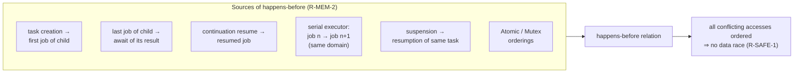

And the requirement dependency graph — note that **everything funnels through R-SEND-5**, the one requirement that was never written down:

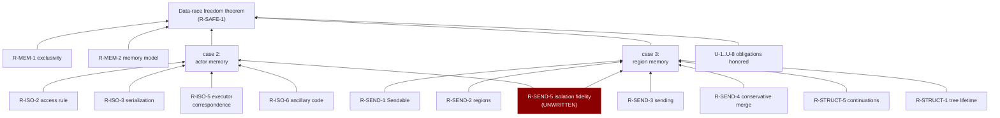

Two observations that matter for §6:

- The theorem is conditional on an unstated lemma: that the static isolation of every value is faithful (R-SEND-5). Case 2 needs it ("accesses occur in jobs isolated to that domain" — but a mis-attributed closure executes domain-`D` accesses from outside `D`); case 3 needs it (a region's classification as disconnected is computed from the isolation attributed to the values in it). Every hole in Appendix B is a failure of this lemma or of the merge rules feeding it.
- The theorem's contract structure means one unsound edge anywhere collapses the whole guarantee — data-race freedom is not graceful-degradation-shaped. This is why the vision documents treat soundness holes as qualitatively different from false positives.


---

## §4 Feature-to-requirement mapping

Every concurrency-relevant keyword, type, attribute, and macro, with its formal reading: what judgment it introduces, and which requirements it serves (upholds) or presupposes (relies on). Grouped by role. "6.2ᶠ" = behind an upcoming flag that is part of the Approachable Concurrency bundle.

### §4.1 Effects and control flow

| Feature | Since | Formal semantics | Requirements |
|---|---|---|---|
| `async` (effect) | 5.5 | Type-level effect marking a function as a sequence of jobs; callable only from async contexts or via task creation | upholds R-ISO-4 (makes suspension structural) |
| `await` | 5.5 | Marks every potential suspension point; the only places a job may end | upholds R-ISO-4; relies on R-RUN-2 |
| `async let` | 5.5 | Sugar for a structured child task; binding forces `await`; scope exit implicitly cancels+awaits | upholds R-STRUCT-1 |
| `await` in `defer` | 6.4 | `defer` body inherits enclosing isolation; deferred awaits complete on every exit path | upholds R-ISO-6, R-STRUCT-1 (SE-0493) |
| `for await` / `AsyncSequence` | 5.5/6.0 | Pull-based iteration; one potential suspension per element; `Failure` type + typed throws (SE-0421) | relies on R-ISO-4 |

### §4.2 Isolation: declaring and inheriting domains

| Feature | Since | Formal semantics | Requirements |
|---|---|---|---|
| `actor` | 5.5 | Nominal type = new isolation domain per instance + serial executor + implicit `Sendable`; stored state accessible sync only via `self`-isolated code | upholds R-ISO-1..4 |
| `@globalActor` / `@MainActor` | 5.5 | Singleton process-wide domain; annotatable on any declaration; inferred through conformance/override/containment | upholds R-ISO-1; MainActor additionally pins its executor to the main thread (§8.3) |
| `nonisolated` | 5.5 | Removes a declaration from any domain; may sync-access only immutable Sendable state | upholds R-ISO-1; relies on R-SEND-1 |
| `nonisolated` on types/extensions | 6.1 | Cuts off global-actor inference for all members (SE-0449) | serves R-META-2 |
| `nonisolated(unsafe)` | 5.10 | U-2 opt-out: asserts external protection of storage | waives R-ISO for one decl (SE-0412) |
| `isolated` parameter | 5.5 | Function's domain = the argument actor value; isolation becomes value-polymorphic | upholds R-ISO-1 (SE-0313) |
| `#isolation` (macro) | 6.0 | Expands to the caller's isolation as an `(any Actor)?` default argument — caller-inherited isolation without an explicit parameter | upholds R-ISO-1 (SE-0420) |
| `nonisolated(nonsending)` | 6.2 | Async function runs *in the caller's domain*: no boundary is crossed, so non-Sendable arguments flow freely; formally, isolation is a hidden `isolated` parameter bound to `#isolation` | upholds R-META-1/2; changes which crossings exist for R-SEND (SE-0461) |
| `@concurrent` | 6.2 | Async function always switches to the global concurrent executor (the old SE-0338 default, now opt-in); all non-Sendable arguments must cross | opposite pole of SE-0461; relies on R-SEND-2/3 |
| `isolated deinit` | 6.2 | Deinit runs on the actor's executor (enqueued if needed) | upholds R-ISO-6 (SE-0371) |
| Flow-sensitive actor `init`/`deinit` | 5.5+ | Before `self` escapes, a nonisolated init may access stored properties; after, normal rules | upholds R-ISO-6 (SE-0327) |
| `@MainActor` default isolation (module) | 6.2 | SE-0466: per-module rule making unannotated declarations MainActor-isolated ("single-threaded by default") | upholds R-META-1/3; creates dialects per R-META-5 |
| Isolated conformances (`@MainActor P`) | 6.2ᶠ | Conformance carries isolation; usable only inside the domain; generic escape prevented via `SendableMetatype` constraints | upholds R-ISO-7 (SE-0470) |
| Top-level code is `@MainActor` | 5.7 | Script/main.swift statements are main-actor-isolated | upholds R-ISO-1 (SE-0343) |
| `@available(*, noasync)` | 5.7 | Bans thread-affine APIs in async contexts | upholds R-BRIDGE-5 (SE-0340) |

### §4.3 Sendability and crossing

| Feature | Since | Formal semantics | Requirements |
|---|---|---|---|
| `Sendable` | 5.5 | Marker protocol: "values freely crossable"; structural conformance checking | upholds R-SEND-1 (SE-0302) |
| `@Sendable` (function types) | 5.5 | Closure captures only Sendable values, by value; the function value itself is crossable | upholds R-SEND-1 |
| `@unchecked Sendable` | 5.5 | U-1 opt-out | waives R-SEND-1 checking |
| `~Sendable` | 6.4 | Suppresses Sendable inference on the primary decl; unlike the unavailable-conformance idiom, not inherited | serves R-META-2 hygiene (SE-0518) |
| `SendableMetatype` | 6.2 | Capability protocol: "this type's metatype/conformances may cross domains"; the lever SE-0470 uses to fence isolated conformances | upholds R-ISO-7 |
| `sending` (param/result) | 6.0 | R-SEND-3 exactly: disconnected-region obligation + re-send right | upholds R-SEND-3 (SE-0430) |
| Region-based isolation | 6.0 | The R-SEND-2 dataflow itself (see §5.2) | upholds R-SEND-2/4 (SE-0414) |
| `@isolated(any)` function type | 6.0 | Function value dynamically carries its isolation (`.isolation: (any Actor)?`); the only isolation-preserving erasure in the language | upholds R-SEND-5 (the only feature that does!) (SE-0431) |
| Sendable methods/key paths | 6.0ᶠ | Unapplied method references & key-path literals get `& Sendable` inferred from captures | upholds R-SEND-1 (SE-0418) |
| Isolated default values | 5.10 | Default args/property initializers evaluate in the declaration's domain | closes an R-ISO-6 hole (SE-0411) |
| Strict global variables | 5.10 | Every global/static var must be isolated, immutable+Sendable, or U-2 | closes an R-ISO-2 hole (SE-0412) |
| GAI-type usability bundle | 6.0ᶠ | Global-actor-isolated types: nonisolated Sendable storage usable cross-domain; GAI closures may capture non-Sendable | serves R-META-2 (SE-0434) |
| `weak let` | 6.3ᶠ | Weak refs may be immutable; nil-on-destruction is not a binding mutation, so Sendable classes may hold them | refines R-SEND-1 structural rule (SE-0481) |

### §4.4 Tasks and structure

| Feature | Since | Formal semantics | Requirements |
|---|---|---|---|
| `Task { }` | 5.5 | Unstructured root; inherits priority, task-locals, and enclosing actor context (via `@isolated(any)` capture) | R-STRUCT-4; escapes R-STRUCT-1 deliberately |
| `Task.detached { }` | 5.5 | Root inheriting nothing | escapes R-STRUCT-1/4 deliberately |
| `withTaskGroup` / `withThrowingTaskGroup` | 5.5 | Dynamic set of structured children; results consumed as an AsyncSequence; error ⇒ cancel siblings | upholds R-STRUCT-1/2/3 (SE-0304) |
| `DiscardingTaskGroup` | 5.9 | Children's results discarded eagerly (bounded memory); auto sibling-cancellation on error | R-STRUCT-1 for server loops (SE-0381) |
| `Task.immediate` / `addImmediateTask` | 6.2 | Task starts synchronously in the calling context up to first suspension, then normal scheduling | refines R-RUN scheduling; isolation rules unchanged (SE-0472) |
| Cancellation APIs (`isCancelled`, `checkCancellation`, `withTaskCancellationHandler`) | 5.5 | Observation of the monotonic flag | R-STRUCT-2 |
| `withTaskCancellationShield` | 6.4 | Masks observation of cancellation in a scope; flag itself unchanged | amends R-STRUCT-2 (SE-0504) |
| `@TaskLocal` (macro) | 5.5 | Scoped binding inherited down the task tree | R-STRUCT-4 (SE-0311) |
| Task priority escalation handlers | 6.2 | Exposes R-STRUCT-3 escalation events (SE-0462) | R-STRUCT-3 |
| Typed-throws `Task` init + unused-handle warning | 6.4 | `Task<Success, Failure>` with `throws(Failure)`; warns when a throwing task's errors are silently dropped | hygiene on R-STRUCT (SE-0520) |
| `Task(name:)` | 6.2 | Diagnostics only (SE-0469) | — |

### §4.5 Executors and runtime

| Feature | Since | Formal semantics | Requirements |
|---|---|---|---|
| `SerialExecutor` / `unownedExecutor` | 5.9 | Custom domain scheduling; implementor assumes R-ISO-3 as U-6 obligation | R-ISO-3 (SE-0392) |
| `TaskExecutor` preference | 6.0 | Task-scoped choice of where nonisolated async code runs; never overrides isolation | refines SE-0338/R-ISO-5 (SE-0417) |
| `assumeIsolated` / `preconditionIsolated` / `assertIsolated` | 5.9 | Dynamic proof of domain membership; `assume` licenses static isolation for a scope (U-7) | R-RUN-4 |
| `checkIsolation()` / `isIsolatingCurrentContext()` | 6.0/6.2 | Executor-defined dynamic isolation predicate | R-RUN-4 (SE-0424, SE-0471) |
| `Clock` / `Instant` / `Duration` | 5.7 | Time abstraction for scheduling & `sleep` | substrate for R-RUN (SE-0329, SE-0457) |
| `Mutex<State>` | 6.0 | `withLock` = exclusive critical section over protected state; conditionally Sendable | R-MEM-2 edge source (SE-0433) |
| `Atomic<T>` | 6.0 | SE-0282 orderings reified | R-MEM-2 (SE-0410) |
| Cooperative thread pool | 5.5 | Width ≈ cores; jobs must not block on pool-internal futures | R-RUN-1/2 |

### §4.6 Bridging and migration

| Feature | Since | Formal semantics | Requirements |
|---|---|---|---|
| `withCheckedContinuation` / `withUnsafeContinuation` | 5.5 | R-STRUCT-5 bridge; checked = enforced, unsafe = U-3 | R-STRUCT-5 (SE-0300) |
| `AsyncStream` / `AsyncThrowingStream` | 5.5 | Buffered multi-shot bridge with defined buffering policy + `onTermination` | R-STRUCT-5 generalized (SE-0314, SE-0388, SE-0468) |
| ObjC async import | 5.5 | Completion-handler methods become `async` | R-BRIDGE-1 (SE-0297) |
| `@Sendable` completion-handler import | 6.2 | R-BRIDGE-2 exactly (SE-0463) | R-BRIDGE-2 |
| `@preconcurrency` (import & decl) | 5.6 | R-BRIDGE-3 diagnostic degradation; U-5 | R-BRIDGE-3 |
| Dynamic isolation enforcement | 6.0 | Compiler-inserted traps at unchecked boundaries | R-BRIDGE-4 (SE-0423) |
| `-strict-concurrency=minimal/targeted/complete` | 5.6 | Staged enablement of the checker; `complete` ≡ Swift 6 mode semantics | R-META-4 / U-8 |
| Approachable Concurrency flag bundle | 6.2 | `DisableOutwardActorInference` + `GlobalActorIsolatedTypesUsability` + `InferIsolatedConformances` + `InferSendableFromCaptures` + `NonisolatedNonsendingByDefault` | R-META-1/2; dialect per R-META-5 |
| Migration builds (per upcoming flag) | 6.2 | Mechanical, semantics-preserving fix-its | R-META-4 |
| `Observations` (transactional observation) | 6.2 | Values emitted at the observing isolation's next suspension point — anti-tearing tied to R-ISO-4 | relies on R-ISO-4 (SE-0475) |
| Distributed actors (`distributed actor/func`) | 5.7 | Actor isolation generalized across process boundaries; location transparency | extends R-ISO to networks (SE-0336, SE-0344) — out of scope here |

### §4.7 The executor-hop picture (what `await` actually does)

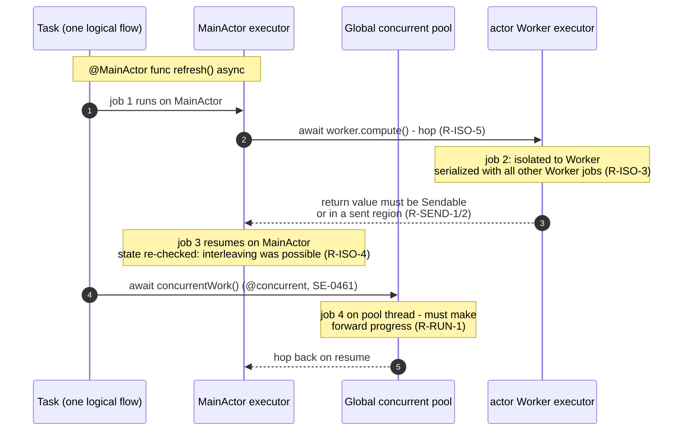

The single most misunderstood consequence of R-ISO-4: between steps 2 and 5, other MainActor jobs may run. `await` is a transaction boundary for actor invariants, not a pause.


---

## §5 The enforcement architecture: who checks what

R-SAFE-1 is not enforced by one checker. It is enforced by a pipeline, each stage of which sees a different representation of the program and owns different judgments. Understanding this pipeline is the prerequisite for understanding the motivating bug, because the bug lives between stages.

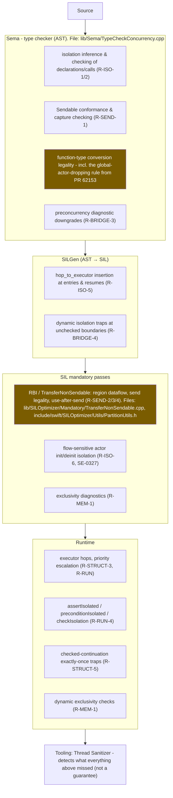

Key facts about this architecture, all cornerstones for §6:

1. **Sema is flow-insensitive; RBI is flow-sensitive.** Sema judges declarations, expressions, and types; it cannot track what happens to a value across statements. RBI (SE-0414's own words) is "a new control-flow-sensitive diagnostic … an optimistic forward dataflow problem" over SIL. The division is principled: type-shaped judgments in Sema, value-flow judgments in RBI.

2. **The hand-off is real and intended.** From the motivating thread, describing current behavior: converting an isolated closure "to a non-Sendable function type and attempting to pass that along is **tolerated in Sema, which delegates responsibility to region analysis** to enforce concurrency safety." And the delegation sometimes works — bind the converted closure to a `let` first and RBI correctly rejects the send.

3. **The hand-off contract is written nowhere.** There is no document, invariant, assertion, or test suite that states what Sema guarantees to RBI (or vice versa) about isolation information surviving lowering. The strongest statements of the contract in existence are a 2022 PR description and inline comments in `PartitionUtils.h`.

4. **RBI contains deliberate diagnostic-suppression heuristics** whose justifying premise is recorded only as comments. Two matter here (quoted from `PartitionUtils.h` via [thread 87519](https://forums.swift.org/t/rbi-failure-to-diagnose-invalid-use-after-sends-permits-data-race-safety-holes/87519)):

   ```cpp
   // If our callee and region are both actor isolated and part of the same
   // isolation domain, do not treat this as a send.
   ```
   ```cpp
   // If our instruction does not have any isolation info associated with it,
   // it must be nonisolated. See if our function has a matching isolation to
   // our sent operand. If so, we can squelch this.
   ```

   Both encode the heuristic **"matching isolation ⇒ no send happened."** That heuristic was true before SE-0430; `sending` made it false (a `sending` parameter confers the right to *re-send from anywhere*, including from a same-isolation callee — `Task.detached { fn() }`).

5. **The runtime is the last line of defense, and it has caught real failures of the layers above** — the Swift 6.3.2 miscompile ([#88993](https://github.com/swiftlang/swift/issues/88993)/[#89214](https://github.com/swiftlang/swift/issues/89214)), where codegen failed to hop back to the MainActor after an await and `MainActor.preconditionIsolated()`/`dispatch_assert_queue` was what surfaced it in production. R-ISO-5 violations are miscompiles, not diagnostics gaps.

### §5.1 Ownership matrix

| Judgment | Owner | Backstop |
|---|---|---|
| "Declaration D has isolation ι" | Sema (inference) | runtime assertions (R-RUN-4) |
| "This sync access to isolated state is legal" (R-ISO-2) | Sema | dynamic traps at unchecked boundaries (SE-0423) |
| "Type T is Sendable" (R-SEND-1) | Sema | none (marker protocol, no runtime) |
| "This function conversion is legal" | Sema | **supposed to be RBI — this is the disputed touchpoint** |
| "Value v may cross boundary B" (R-SEND-2/3) | RBI | none |
| "No use-after-send" | RBI | none |
| "Code runs on the executor of its isolation" (R-ISO-5) | SILGen (+ runtime hop machinery) | `preconditionIsolated`, `dispatch_assert_queue` |
| "Actor init/deinit isolation phases" (R-ISO-6) | SIL mandatory (flow isolation) | — |
| "Exclusivity" (R-MEM-1) | Sema + SIL + runtime | runtime traps |
| "Continuation resumed exactly once" (R-STRUCT-5) | runtime (checked) | U-3 if unsafe |
| "Serial executor really serializes" (R-ISO-3, custom) | **nobody — U-6 programmer obligation** | `checkIsolation` if implemented |
| "Forward progress on the pool" (R-RUN-1) | **nobody — documented contract only** | watchdog/deadlock in practice |

The two "nobody" rows and the one "disputed touchpoint" row are exactly where §6 finds the trouble.

### §5.2 The RBI formal fragment (what the flow-sensitive layer actually computes)

For completeness, the one piece of Swift concurrency that *is* formally specified — SE-0414's appendix — in brief:

- **Abstract state:** a partition of values into regions, maintained as an alias graph (nodes = non-Sendable values; edges = "same region").
- **Lattice:** graphs ordered by `g1 ≤ g2 ⟺ g1 ∪ g2 = g1`; ⊤ = fully disconnected, ⊥ = fully connected. Control-flow merge = graph union (pessimistic toward connectedness).
- **Transfer function** (per instruction, e.g. `y = f(a₀…aₙ)`): merge all non-Sendable argument regions; the non-Sendable result joins that merged region (fresh region if no non-Sendable args). Assignments and property accesses are treated as applications. Deliberately conservative per R-SEND-4.
- **Send:** passing a region across a boundary (isolated callee, `sending` parameter, isolated closure capture) marks the region sent; any later `require`(use) of a value in a sent region is diagnosed.
- **Convergence:** monotone transfer over a finite lattice; backedges seeded with ⊤; standard optimistic forward dataflow.
- **Region statuses:** disconnected / actor-isolated / task-isolated / sent. Merging into actor-isolated is absorbing (permanent).

The theoretical basis (Milano, Turcotti & Myers, PLDI 2022 — the Gallifrey type system) carries a machine-independent soundness proof: in the calculus, well-typed programs are data-race-free. The catch, developed next, is that the calculus does not model Swift's isolation-erasing function conversions, and the implementation added heuristics the calculus does not license.

---

## §6 Consistency and satisfiability analysis

Three separate questions, often conflated:

- **Q1 (Consistency):** Can all the stated requirements be true at once — does a model exist? (§6.1)
- **Q2 (Faithfulness):** Is the shipped implementation a model of them? (§6.2, §6.4)
- **Q3 (Satisfiability under the meta-requirements):** Can any practical implementation satisfy the technical requirements while also honoring R-META-1..5? (§6.3)

### §6.1 Q1: The requirement set is consistent — with two caveats

**The core is consistent.** A model exists by construction in three layers, each with independent support:

1. R-MEM-2's happens-before model is the standard C/C++ model — consistent, decades of use.
2. R-ISO-2/3/4 (actors as serialized domains) is the classic actor model plus re-entrancy; serialization trivially yields happens-before edges within a domain.
3. R-SEND-2/3/4 (linear region transfer) is proved sound in PLDI 2022 for the calculus SE-0414 adapted: regions are affine — at most one domain can reach a region at a time — so cross-domain conflicting access pairs cannot exist for region-classified memory.

Composing 1–3 gives exactly the theorem of §3. Nothing in the composition is contradictory. **Swift's data-race-safety design is not a perpetual-motion machine; it is a sound design on paper.**

**Caveat A — R-SAFE-3 (no deadlocks) is quietly abandoned in the strong form.** The 2020 roadmap promised eliminating "data races and deadlocks." What shipped eliminates *actor-mailbox* deadlocks (via re-entrancy) but permits: blocking a cooperative thread (R-RUN-1 violations deadlock the pool), `assumeIsolated` misuse, and classic lock-ordering deadlocks with `Mutex`. The requirement was silently weakened, never formally retracted. This is a consistency issue between documents, not within the shipped set — but it illustrates the absence of a requirements registry where such a retraction would be recorded.

**Caveat B — R-ISO-1's "exactly one isolation" and R-SEND-5's fidelity are in tension with type erasure.** The declaration-level story (every decl has one isolation) is consistent. But values of function type outlive declarations, and the type system permits conversions that erase isolation from the type while the underlying value retains it behaviorally. Unless erased-but-retained isolation is tracked somewhere else (RBI regions or `@isolated(any)`), the requirement set is consistent only under the additional, unwritten axiom R-SEND-5. With R-SEND-5 stated, the set is consistent; without it, the set is incomplete — it fails to determine the semantics of exactly the programs in the bug family. **The requirements as actually written down by the project do not decide the motivating bug.** That is the precise sense in which your diagnosis — "the real cause is the lack of a coherent document" — is correct.

### §6.2 Q2: The implementation is not a model — anatomy of the motivating bug

The [88002 bug](https://forums.swift.org/t/which-subsystem-is-responsible-for-preventing-this-concurrency-bug/88002) ([issue #90271](https://github.com/swiftlang/swift/issues/90271), TSan-confirmed race):

```swift
@MainActor final class C { var state = 0 }

func send(_ fn: sending @escaping () -> Void) {
    Task.detached { fn() }          // right conferred by `sending` (R-SEND-3)
}

@MainActor func bug(_ c: C) {
    send { @MainActor in c.state += 1 }  // conversion drops @MainActor from the type
    c.state += 1                          // races with the detached call
}
```

Walk the pipeline and watch the isolation information die:

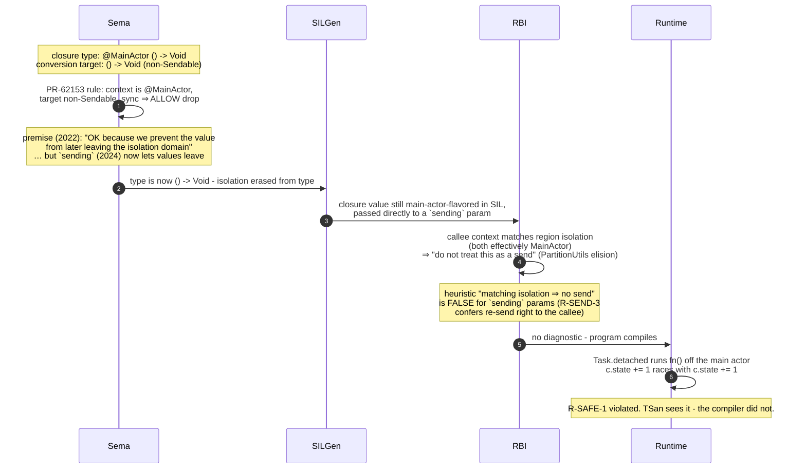

Formal reading. Sema's conversion rule (call it **C-DropGA**) has a soundness side condition:

> C-DropGA is sound iff the converted value never subsequently crosses an isolation boundary.

In 2022 the side condition was discharged by exhaustion: the only crossing mechanism for function values was `@Sendable`, and C-DropGA already refuses `Sendable` targets. **SE-0430 added a second crossing mechanism (`sending`) and the side condition silently became undischargeable by Sema alone** — Sema is flow-insensitive and cannot know whether the converted value will meet a `sending` parameter. The judgment had become flow-sensitive, i.e. it had migrated into RBI's jurisdiction — but RBI's elision heuristics ("matching isolation ⇒ no send") were built on the pre-`sending` world too, so both layers wave it through. Meanwhile, the variant with an intermediate `let fn` is caught by RBI, proving the hand-off is implementable — the failure is not capability but contract: no artifact forced SE-0430's authors to enumerate every rule whose soundness premise mentions "crossing," because that premise was recorded in a PR description, not a requirements document.

This is the general shape of nearly every hole in Appendix B: **a sound-in-2022 premise, stored in an unqueryable location, invalidated by a 2024 requirement change, discovered by users in 2025–26.** The same analysis covers:

- [#79836](https://github.com/swiftlang/swift/issues/79836) — the original report of this family (C-DropGA × `sending`).
- [#89736](https://github.com/swiftlang/swift/issues/89736) — RBI's *intra-actor send elision* (`PartitionUtils.h` L2058: same-isolation callee ⇒ not a send) ignores `sending` even with no conversion involved; fix [PR #90075](https://github.com/swiftlang/swift/pull/90075) adds the `sending` carve-out that the disconnected-region branch a few lines below always had.
- [#86896](https://github.com/swiftlang/swift/issues/86896) — the squelch heuristic suppresses a real use-after-send diagnostic that RBI had already computed ("errors are never surfaced because there is logic in the partition op evaluator that suppresses it" — thread 87519).

And the sociological finding matches the technical one: the fix PRs ([#86223](https://github.com/swiftlang/swift/pull/86223) in Sema, [#90075](https://github.com/swiftlang/swift/pull/90075) in RBI) have been open since December 2025 and June 2026 respectively with **zero reviewer feedback**, review requests pending to the code owners of both layers — because deciding between them requires exactly the ownership doctrine that no document states. jamieQ's four options in thread 88002 ("fix Sema? fix RBI? both? something else?") is an engineer asking for a requirements document in real time.

### §6.3 Q3: Satisfiability under the meta-requirements — yes, but the margin is thin

Add R-META-1..5 to the technical set and ask whether any implementation can satisfy everything. Three structural tensions define the feasible region:

**T1: Soundness × annotation minimization.** A modular, flow-insensitive checker that is sound must over-approximate; over-approximation means false positives; false positives violate R-META-2. Swift's answer is to buy precision with machinery (regions, `sending`, `@isolated(any)`, isolated conformances) and buy silence with defaults (SE-0466 MainActor-by-default, SE-0461 caller-isolation-by-default). Both purchases are legitimate. The danger zone is the third instrument: **carve-outs** — rules like C-DropGA and the RBI elisions that trade soundness risk for ergonomics in specific patterns. Every carve-out is a standing proof obligation, and Swift currently has no ledger of them. T1 is satisfiable, but only if carve-outs are tracked as first-class debts.

**T2: Modular checking × flow-sensitive judgments.** R-META-3 forbids whole-program analysis; R-SEND-2/3 are inherently flow-sensitive. The resolution — flow-sensitivity within a function body (RBI), types between functions (`sending`, `Sendable`, isolation in signatures) — is sound and standard. But it hard-codes an interface: **everything a caller's flow analysis proves must be encoded in the callee's type, and vice versa.** Any information that exists in Sema but is erased before SIL (or vice versa) is a leak in that interface. C-DropGA is precisely such a leak: it erases isolation from the type — the only channel the modular architecture has. T2 is satisfiable iff type-erasure of safety-relevant facts is prohibited or compensated (that is what §7's INV-1 does).

**T3: Evolution × dialect stability.** The meaning of `nonisolated async` has now had two contradictory normative answers — SE-0338 (2022: always off-actor) and SE-0461 (2025: caller's actor, `@concurrent` to opt out) — plus a flag (`NonisolatedNonsendingByDefault`) selecting between them per module, plus SE-0466 making unannotated isolation itself a per-module variable. The result: **a Swift source file no longer has a meaning; a (file, mode, flag-set, default-isolation) tuple does.** The vision document accepts this openly (R-META-5: "modest and manageable"). It is manageable — but only with a semantics document indexed by dialect, which does not exist. Note also what T3 did historically: SE-0338 itself introduced holes ([forum 75332](https://forums.swift.org/t/calling-non-isolated-async-method-from-a-child-task-inheriting-global-actor-allows-for-a-race-condition-in-swift-6/75332): Swift 5.10 rejected code that Swift 6.0 raced on) because the executor-switch rule changed under code whose safety argument assumed the old rule.

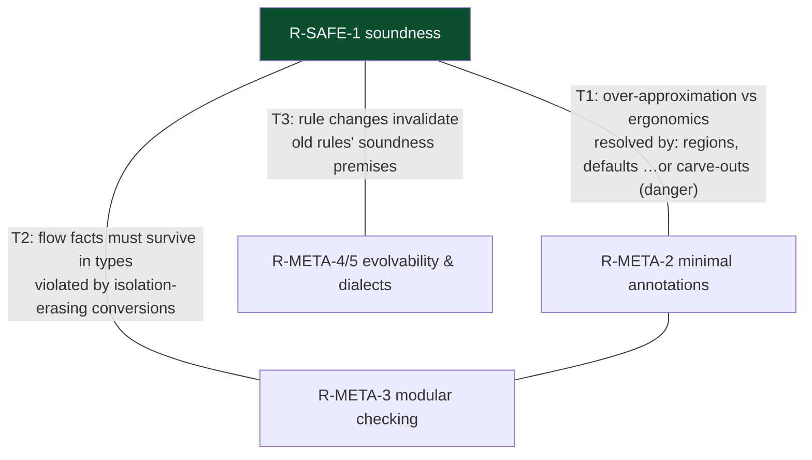

**Verdict on Q3:** the full set (technical + meta) is satisfiable — no tension above is a contradiction — but each tension names a discipline the project must maintain (a carve-out ledger, an erasure prohibition, a dialect-indexed semantics), and none of the three disciplines currently has an artifact enforcing it. The holes are the interest payments on that missing infrastructure.

### §6.4 The evidence base: nine known holes, one touchpoint

Full detail in Appendix B; the distribution is the argument:

| Failure locus | Holes | Pattern |
|---|---|---|
| Sema conversion rules × `sending` | #79836, #90271 | C-DropGA side condition invalidated by SE-0430 |
| RBI same-isolation elision | #89736, #74820, part of #82827 | "matching isolation ⇒ no send" false under `sending`/detached tasks |
| RBI squelch (suppressed real diagnostics) | #86896, part of 87519 | computed error never surfaced |
| RBI region merging for isolated Task captures | #76929, #82827, forum 75332 | captures in isolated closures under-merged; hborla: "a bug in region based isolation" |
| SILGen/codegen hop insertion (R-ISO-5) | #88993/#89214 (fixed) | miscompile — wrong executor after resume; caught by runtime assertion |

Eight of nine cluster on the Sema↔RBI touchpoint and its heuristics; the ninth is the one class the runtime backstop actually catches. **No hole is a counterexample to the theory of §3; every hole is a counterexample to the implementation's claim to implement it.** That is simultaneously reassuring (nothing needs to be re-designed from scratch) and damning (the same touchpoint keeps producing the same failure, which is what un-specified interfaces do).


---

## §7 Constructive criticism: how to make it consistent

Ordered from cheap-and-immediate to structural. C1–C3 would have prevented or would now mechanically resolve the motivating bug; C4–C6 prevent the next family.

### C1. Write the normative semantics down, with requirement IDs

A living `docs/ConcurrencySemantics.md` in swiftlang/swift (or a TSPL "reference" companion) that states the requirements of §2 normatively, each with an ID, an owner (per §5.1's matrix), and a change log. Mechanics that make it stick rather than rot:

- Every carve-out (C-DropGA and friends) is registered with its soundness side condition stated explicitly. The ledger is greppable; an SE proposal that changes any crossing mechanism must include a "carve-out audit" section, exactly as proposals today must include "source compatibility" and "ABI stability" sections. This is a template change to the evolution process — nearly free, and it is the single measure that would have caught SE-0430 × C-DropGA at review time.
- Diagnostics and suppression heuristics reference requirement IDs in code comments, so `PartitionUtils.h`'s elisions would read "sound by R-SEND-2 assuming no `sending` operand (see ledger entry CO-7)" instead of a bare English sentence.

### C2. Adopt a single-owner doctrine for every judgment

Answering thread 88002 in general rather than per-bug: **every safety judgment has exactly one owning layer; other layers may duplicate it only as assertions, never as the sole enforcement.** A workable assignment consistent with the current architecture:

- Type-shaped, flow-insensitive facts (declaration isolation, Sendable conformance, conversion legality given types alone) → Sema.
- Value-flow facts (region status, crossing legality, use-after-send) → RBI.
- **Consequence:** any Sema rule whose soundness depends on a value-flow fact (like "never later crosses") is illegitimate as written — it must either be strengthened to a pure type judgment (refuse the conversion) or be compiled into information RBI can enforce (see C3/INV-1). This doctrine resolves 88002's question 1-vs-2 mechanically: the answer is "2, plus Sema stops relying on premises it cannot check" — or, if the project prefers ergonomics, "1" — but the doctrine forces a decision instead of a four-way shrug.

### C3. State and enforce the missing invariant (INV-1)

The unwritten R-SEND-5, made checkable at the SIL boundary:

> **INV-1 (No erasure without tagging).** For every SIL value `v` of function type: if the function's behavior is isolated to domain `D`, then either (a) `v`'s SIL type carries `D` (unconverted), or (b) `v` is `@isolated(any)` (isolation carried dynamically), or (c) RBI's partition state records `v`'s region as `D`-isolated.

Concretely: an isolation-dropping conversion, instead of producing a value RBI may classify as disconnected, produces a value whose region is **born actor-isolated to `D`**. Then, with no further special cases:

- passing it to a `sending` parameter is rejected (actor-isolated regions cannot be sent — R-SEND-2 already says so) → kills #79836, #90271, the 88002 example;
- the same-isolation elision becomes unnecessary where it was sound and impossible where it was not → kills #89736's class (direction of PR #90075, but derived from an invariant rather than added as one more carve-out);
- the squelch heuristic loses its justifying premise and is removed; RBI surfaces what it computes → kills #86896's class.

INV-1 is assertable: a SIL verifier check can compare SILGen's known closure isolation against RBI's initial partition, turning "the layers disagree about what got erased" from a latent data race into a compiler assertion failure. This is the cheapest structural fix on offer, and it is incremental — it re-derives PRs #86223 and #90075 as corollaries instead of point patches.

### C4. Build the litmus-test corpus (an executable specification)

Memory models learned this decades ago: prose models rot, litmus tests do not. A `test/Concurrency/litmus/` corpus where each test is (program, dialect tuple, verdict: accept / diagnostic-ID / trap), covering every requirement ID and every ledger carve-out, run in CI across `-strict-concurrency` levels × upcoming-flag combinations × default-isolation settings. Every soundness-hole fix adds its repro. This is also the *dialect-indexed semantics* T3 demands — expressed as tests, which is the only form that scales to 2ⁿ flag combinations. (The compiler's existing test suite has pieces of this; the missing property is requirement-indexed coverage claims, i.e. the ability to answer "which tests witness R-SEND-3?")

### C5. Extend the formal model to cover what actually broke

The PLDI 2022 calculus proves the region core sound, but the holes live in features the calculus does not model: isolation-erasing conversions, task-isolated regions, `@isolated(any)`, `sending` results, isolated conformances. A modest formalization effort (a mechanized model in the style of the SE-0414 appendix, extended with function conversions and dialect parameters; a student-project-sized effort, not a moonshot) would have forced the discovery that C-DropGA and `sending` cannot both be sound-by-construction. The project already cites academic foundations; the ask is to keep the model in sync with the shipped surface, treating "feature not in the model" as a review flag on new proposals.

### C6. The long-term type-system direction: stop erasing isolation

The root enabler of the whole hole family is that Swift function types default to not carrying isolation, so conversions must erase. The already-shipped `@isolated(any)` shows the alternative: carry it. A future language mode could:

- make isolation-annotated function types non-convertible to isolation-free types (the conversion becomes a closure wrapper with an explicit hop, or requires `@isolated(any)`);
- treat today's erasing conversions as deprecated, with migration per R-META-4;
- in the limit, make `@isolated(any)` the representation of all non-`@Sendable` function values, so "what isolation does this value have" is always answerable — statically where known, dynamically otherwise.

This is source-breaking and needs the vision-document treatment; it is listed last for that reason. But note it converts R-SEND-5 from an invariant needing enforcement into a triviality — the information is simply never lost.

### What this buys, mapped back

| Measure | Cost | Kills | Prevents recurrence via |
|---|---|---|---|
| C1 requirements doc + carve-out ledger | days–weeks, process | — | review-time audit obligation |
| C2 single-owner doctrine | a decision + doc | the 88002 stalemate | ownership answer exists before the bug |
| C3 INV-1 | one SIL rule + verifier check | #79836, #90271, #89736, #86896 classes | invariant, not patches |
| C4 litmus corpus | ongoing CI | regressions incl. #88993-style | executable dialect semantics |
| C5 model maintenance | modest research | design-time contradictions | "not in the model" review flag |
| C6 no-erasure types | language mode | the entire family, permanently | information loss becomes impossible |

---

## §8 Coexistence with preconcurrency: Thread, GCD, locks

Swift concurrency did not replace the preconcurrency world; it annexed it. The relationship is governed by R-RUN-1 (forward progress), R-BRIDGE-1..5, and a set of correspondences that are exact in some places and treacherously approximate in others.

### §8.1 The concept map

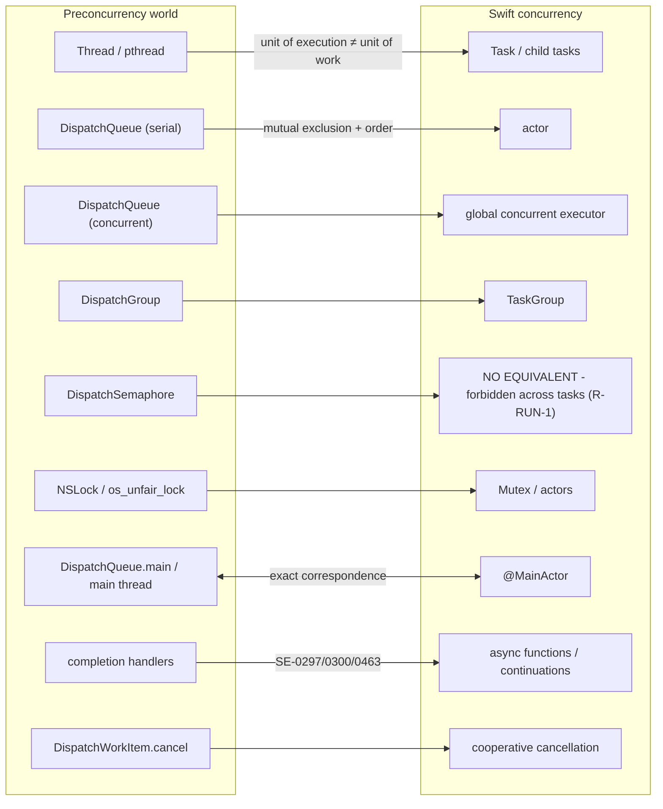

Correspondence quality, row by row:

| Preconcurrency | Concurrency | Fidelity | The catch |
|---|---|---|---|
| Serial `DispatchQueue` | `actor` | Good | Actors are not FIFO (R-RUN-3) and are **re-entrant at awaits** (R-ISO-4); a serial queue's block is atomic, an actor's async function is transactional-per-segment |
| `DispatchQueue.main` | `@MainActor` | Exact by construction | MainActor's executor drains the main queue; `MainActor.assumeIsolated` ⇄ `dispatch_assert_queue(.main)` interconvert (SE-0392/0424); this is why the #88993 miscompile trapped in `dispatch_assert_queue` |
| Concurrent queue | global concurrent executor | Good | Pool width ≈ cores and does not grow over blocking — GCD's thread-explosion escape hatch is deliberately absent (R-RUN-1) |
| `DispatchGroup.wait` | `TaskGroup` | Good async-side | `group.wait()` on a pool thread violates R-RUN-1; the structured version awaits |
| `DispatchSemaphore` between work items | — | None | Blocking a cooperative thread on a signal from another task can deadlock the entire pool; also invisible to priority donation. This is the canonical R-RUN-1 violation (WWDC21 10254 says so explicitly) |
| `NSLock`/`os_unfair_lock` | `Mutex` (SE-0433) | Good | Legal iff critical sections are short and **contain no `await`** (a suspension while holding a lock hands the lock's thread away); thread-affine locks (recursive locks, `os_unfair_lock` ownership asserts) break under task-to-thread remapping — R-BRIDGE-5's `noasync` exists for exactly these |
| `Thread.current`, thread-locals, TLS | `@TaskLocal` | Semantic replacement | Tasks migrate threads at every suspension; thread identity is meaningless mid-task. `@TaskLocal` follows the task tree instead (R-STRUCT-4) |
| `DispatchWorkItem.cancel` | `Task.cancel` | Same philosophy | Both cooperative; neither preempts (R-STRUCT-2) |
| QoS classes | `TaskPriority` | Good | Escalation is built in for awaits (R-STRUCT-3); GCD needed manual `.userInitiated` plumbing and blocks donation through semaphores |

### §8.2 The two worlds share threads — the rules of engagement

The deep fact: **executors are an abstraction over the same kernel threads GCD and `Thread` use.** MainActor jobs run on the main thread; pool jobs run on cooperative-pool threads; a custom `SerialExecutor` can be backed by any dispatch queue (`DispatchSerialQueue` conforms since SE-0392). Consequently the safety story is *compositional, not separate*:

1. **Old code called from new code** must not block the calling pool thread beyond "brief and bounded" (R-RUN-1). Wrapping a blocking API? Give it its own thread or a `TaskExecutor` preference backed by a wider pool; do not `DispatchSemaphore.wait` for it on the cooperative pool.
2. **New code called from old code** enters via `Task {}` (fire-and-forget from a queue context), `MainActor.assumeIsolated` (when the queue *is* the main queue), or a custom executor identity claim (`checkIsolation`, SE-0424/0471 — lets `dispatch_assert_queue`-style reasoning and actor reasoning agree on who owns a queue).
3. **State shared across the boundary** must satisfy R-SEND-1 the hard way: `@unchecked Sendable` with a real lock (U-1), an actor adopted by both sides, or `Mutex`. The checker cannot see GCD's serialization, so the queue discipline that made the old code safe is invisible to the new checker — this asymmetry, not any runtime incompatibility, is why migration hurts: preconcurrency code isn't unsafe, it's unverifiable.
4. **Callbacks crossing back** are assumed hostile: since SE-0463 every imported ObjC completion handler is `@Sendable` (R-BRIDGE-2), because the platform may invoke it on any queue. Bridging it into task-land is R-STRUCT-5's job: continuation, resumed exactly once, or `AsyncStream` for multi-shot.

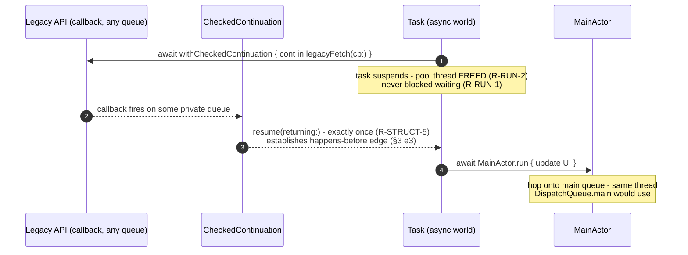

### §8.3 `@preconcurrency`: the formal trust gradient

The migration machinery is itself a formal object — a gradual typing system for data-race safety:

- `@preconcurrency import` (SE-0337): the importing module asserts U-5; Sendable diagnostics involving the import are downgraded/suppressed. Trust is assumed.
- `@preconcurrency` on a declaration: the vendor asserts the decl's new concurrency annotations don't break pre-strict clients; checking degrades per client mode. Trust is grandfathered.
- `@preconcurrency` conformance (e.g. conforming a `@MainActor` class to a nonisolated delegate protocol): static checking is waived and SE-0423 inserts runtime isolation traps at every entry point the conformance vends. Trust is verified dynamically (R-BRIDGE-4: trap, don't race).
- Full Swift 6 mode with no `@preconcurrency`: trust is proved statically.

This gradient — assumed → grandfathered → dynamically-checked → proved — is the correct architecture for annexing a legacy ecosystem, and it is the part of the design that has held up best. Its residual weakness is at the first step: an unannotated or mis-annotated preconcurrency module is a U-5 assertion nobody actually made, and R-SAFE-1 is conditional on it.

### §8.4 The pre/post concurrency timeline

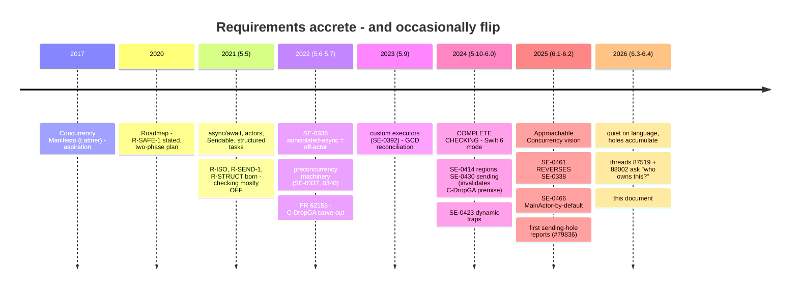

---

## Appendix A: Complete accepted-proposal index

Every accepted/implemented Swift Evolution proposal governing concurrency, with the rule it contributes. (Verified against the canonical proposal headers and [Quinn's index](https://developer.apple.com/forums/thread/768776), July 2026. Ergonomics-only proposals marked ·.)

| SE | Title | Ships | The rule |
|---|---|---|---|
| [0176](https://github.com/swiftlang/swift-evolution/blob/main/proposals/0176-enforce-exclusive-access-to-memory.md) | Exclusive Access to Memory | 4–5 | Law of Exclusivity (R-MEM-1) |
| [0282](https://github.com/swiftlang/swift-evolution/blob/main/proposals/0282-atomics.md) | Memory consistency model | 5.3 | C/C++ happens-before; racy access = UB (R-MEM-2) |
| [0296](https://github.com/swiftlang/swift-evolution/blob/main/proposals/0296-async-await.md) | Async/await | 5.5 | `async` effect; suspension only at `await` |
| [0297](https://github.com/swiftlang/swift-evolution/blob/main/proposals/0297-concurrency-objc.md) | ObjC interop | 5.5 | Completion-handler methods import as async |
| [0298](https://github.com/swiftlang/swift-evolution/blob/main/proposals/0298-asyncsequence.md) | AsyncSequence | 5.5 | Pull iteration, suspension per element |
| [0300](https://github.com/swiftlang/swift-evolution/blob/main/proposals/0300-continuation.md) | Continuations | 5.5 | Resume exactly once (R-STRUCT-5) |
| [0302](https://github.com/swiftlang/swift-evolution/blob/main/proposals/0302-concurrent-value-and-concurrent-closures.md) | Sendable | 5.5 | Crossability is a type property (R-SEND-1) |
| [0304](https://github.com/swiftlang/swift-evolution/blob/main/proposals/0304-structured-concurrency.md) | Structured concurrency | 5.5 | Task tree; scope-bounded children; cooperative cancellation; priority propagation |
| [0306](https://github.com/swiftlang/swift-evolution/blob/main/proposals/0306-actors.md) | Actors | 5.5 | Isolated state; serialized access; re-entrancy at awaits |
| [0311](https://github.com/swiftlang/swift-evolution/blob/main/proposals/0311-task-locals.md) | Task-locals | 5.5 | Tree-scoped values (R-STRUCT-4) |
| [0313](https://github.com/swiftlang/swift-evolution/blob/main/proposals/0313-actor-isolation-control.md) | Isolation control | 5.5 | `isolated` params; `nonisolated`; one isolation per decl |
| [0314](https://github.com/swiftlang/swift-evolution/blob/main/proposals/0314-async-stream.md) | AsyncStream | 5.5 | Buffered sync→async bridge |
| [0316](https://github.com/swiftlang/swift-evolution/blob/main/proposals/0316-global-actors.md) | Global actors | 5.5 | Process-wide domains; isolation inference |
| [0317](https://github.com/swiftlang/swift-evolution/blob/main/proposals/0317-async-let.md) | async let | 5.5 | Implicit structured children |
| [0323](https://github.com/swiftlang/swift-evolution/blob/main/proposals/0323-async-main-semantics.md) | Async main | 5.5 | Entry-point executor setup |
| [0327](https://github.com/swiftlang/swift-evolution/blob/main/proposals/0327-actor-initializers.md) | Actor init/deinit | 5.5+ | Flow-sensitive isolation around `self` escape |
| [0329](https://github.com/swiftlang/swift-evolution/blob/main/proposals/0329-clock-instant-duration.md) | Clock/Instant/Duration | 5.7 | Time substrate · |
| [0331](https://github.com/swiftlang/swift-evolution/blob/main/proposals/0331-remove-sendable-from-unsafepointer.md) | Pointers non-Sendable | 5.6 | Closes a crossing hole |
| [0336](https://github.com/swiftlang/swift-evolution/blob/main/proposals/0336-distributed-actor-isolation.md) | Distributed actor isolation | 5.7 | Isolation across processes |
| [0337](https://github.com/swiftlang/swift-evolution/blob/main/proposals/0337-support-incremental-migration-to-concurrency-checking.md) | @preconcurrency | 5.6 | Graceful degradation at unchecked boundaries |
| [0338](https://github.com/swiftlang/swift-evolution/blob/main/proposals/0338-clarify-execution-non-actor-async.md) | Nonisolated async execution | 5.7 | Off-actor by default — **reversed by SE-0461** |
| [0340](https://github.com/swiftlang/swift-evolution/blob/main/proposals/0340-swift-noasync.md) | noasync | 5.7 | Quarantine thread-affine APIs |
| [0343](https://github.com/swiftlang/swift-evolution/blob/main/proposals/0343-top-level-concurrency.md) | Top-level concurrency | 5.7 | Top-level code is @MainActor |
| [0344](https://github.com/swiftlang/swift-evolution/blob/main/proposals/0344-distributed-actor-runtime.md) | Distributed actor runtime | 5.7 | Location-transparent messaging |
| [0374](https://github.com/swiftlang/swift-evolution/blob/main/proposals/0374-clock-sleep-for.md) | Clock.sleep(for:) | 5.9 | · |
| [0381](https://github.com/swiftlang/swift-evolution/blob/main/proposals/0381-task-group-discard-results.md) | DiscardingTaskGroup | 5.9 | Bounded-memory groups; auto error-cancel |
| [0388](https://github.com/swiftlang/swift-evolution/blob/main/proposals/0388-async-stream-factory.md) | makeStream | 5.9 | · |
| [0392](https://github.com/swiftlang/swift-evolution/blob/main/proposals/0392-custom-actor-executors.md) | Custom executors | 5.9 | SerialExecutor contract (R-ISO-3); assumeIsolated |
| [0401](https://github.com/swiftlang/swift-evolution/blob/main/proposals/0401-remove-property-wrapper-isolation.md) | Prune wrapper inference | 5.9/6ᶠ | Less isolation inference |
| [0410](https://github.com/swiftlang/swift-evolution/blob/main/proposals/0410-atomics.md) | Atomics | 6.0 | SE-0282 reified (R-MEM-2) |
| [0411](https://github.com/swiftlang/swift-evolution/blob/main/proposals/0411-isolated-default-values.md) | Isolated default values | 5.10 | Defaults run in decl's domain (R-ISO-6) |
| [0412](https://github.com/swiftlang/swift-evolution/blob/main/proposals/0412-strict-concurrency-for-global-variables.md) | Strict globals | 5.10 | Globals isolated / immutable / U-2 |
| [0414](https://github.com/swiftlang/swift-evolution/blob/main/proposals/0414-region-based-isolation.md) | **Region-based isolation** | 6.0 | R-SEND-2/4; the formal dataflow (§5.2) |
| [0417](https://github.com/swiftlang/swift-evolution/blob/main/proposals/0417-task-executor-preference.md) | Task executor preference | 6.0 | Where nonisolated-async runs, per task |
| [0418](https://github.com/swiftlang/swift-evolution/blob/main/proposals/0418-inferring-sendable-for-methods.md) | Sendable methods/keypaths | 6.0ᶠ | Inference from captures |
| [0420](https://github.com/swiftlang/swift-evolution/blob/main/proposals/0420-inheritance-of-actor-isolation.md) | Isolation inheritance | 6.0 | Optional isolated params; `#isolation` |
| [0421](https://github.com/swiftlang/swift-evolution/blob/main/proposals/0421-generalize-async-sequence.md) | AsyncSequence effects | 6.0 | Typed throws, primary assoc types · |
| [0423](https://github.com/swiftlang/swift-evolution/blob/main/proposals/0423-dynamic-actor-isolation.md) | Dynamic isolation | 6.0 | Trap-don't-race at trust boundaries (R-BRIDGE-4) |
| [0424](https://github.com/swiftlang/swift-evolution/blob/main/proposals/0424-custom-isolation-checking-for-serialexecutor.md) | checkIsolation | 6.0 | Executor-defined identity |
| [0430](https://github.com/swiftlang/swift-evolution/blob/main/proposals/0430-transferring-parameters-and-results.md) | **sending** | 6.0 | R-SEND-3; the premise-breaker of §6.2 |
| [0431](https://github.com/swiftlang/swift-evolution/blob/main/proposals/0431-isolated-any-functions.md) | @isolated(any) | 6.0 | Isolation carried in the value (R-SEND-5's only friend) |
| [0433](https://github.com/swiftlang/swift-evolution/blob/main/proposals/0433-mutex.md) | Mutex | 6.0 | Checked lock-protected state |
| [0434](https://github.com/swiftlang/swift-evolution/blob/main/proposals/0434-global-actor-isolated-types-usability.md) | GAI usability | 6.0ᶠ | Relaxations for global-actor types |
| [0442](https://github.com/swiftlang/swift-evolution/blob/main/proposals/0442-allow-taskgroup-childtaskresult-type-to-be-inferred.md) | TaskGroup inference | 6.1 | · |
| [0449](https://github.com/swiftlang/swift-evolution/blob/main/proposals/0449-nonisolated-for-global-actor-cutoff.md) | nonisolated cutoff | 6.1 | Types/extensions opt out of inference |
| [0371](https://github.com/swiftlang/swift-evolution/blob/main/proposals/0371-isolated-synchronous-deinit.md) | Isolated deinit | 6.2 | Deinit on the actor's executor (R-ISO-6) |
| [0457](https://github.com/swiftlang/swift-evolution/blob/main/proposals/0457-duration-attosecond-represenation.md) | Attosecond Duration | 6.2 | · |
| [0461](https://github.com/swiftlang/swift-evolution/blob/main/proposals/0461-async-function-isolation.md) | **Caller-actor default for nonisolated async** | 6.2ᶠ | Reverses SE-0338; `nonisolated(nonsending)` + `@concurrent` |
| [0462](https://github.com/swiftlang/swift-evolution/blob/main/proposals/0462-task-priority-escalation-apis.md) | Priority escalation APIs | 6.2 | Exposes R-STRUCT-3 |
| [0463](https://github.com/swiftlang/swift-evolution/blob/main/proposals/0463-sendable-completion-handlers.md) | @Sendable handler import | 6.2 | Pessimistic import (R-BRIDGE-2) |
| [0466](https://github.com/swiftlang/swift-evolution/blob/main/proposals/0466-control-default-actor-isolation.md) | **Default isolation control** | 6.2 | Per-module MainActor default (R-META-1/5) |
| [0468](https://github.com/swiftlang/swift-evolution/blob/main/proposals/0468-async-stream-continuation-hashable-conformance.md) | Hashable continuations | 6.2 | · |
| [0469](https://github.com/swiftlang/swift-evolution/blob/main/proposals/0469-task-names.md) | Task naming | 6.2 | · |
| [0470](https://github.com/swiftlang/swift-evolution/blob/main/proposals/0470-isolated-conformances.md) | Isolated conformances | 6.2ᶠ | R-ISO-7; SendableMetatype fence |
| [0471](https://github.com/swiftlang/swift-evolution/blob/main/proposals/0471-SerialExecutor-isIsolated.md) | isIsolatingCurrentContext | 6.2 | Refined executor identity |
| [0472](https://github.com/swiftlang/swift-evolution/blob/main/proposals/0472-task-start-synchronously-on-caller-context.md) | Immediate tasks | 6.2 | Sync start up to first suspension |
| [0475](https://github.com/swiftlang/swift-evolution/blob/main/proposals/0475-observed.md) | Transactional observation | 6.2 | Emission at suspension points (R-ISO-4-aligned) |
| [0481](https://github.com/swiftlang/swift-evolution/blob/main/proposals/0481-weak-let.md) | weak let | 6.3ᶠ | Weak refs immutable ⇒ Sendable-compatible |
| [0493](https://github.com/swiftlang/swift-evolution/blob/main/proposals/0493-defer-async.md) | async defer | 6.4 | Awaits in defer; inherits isolation (R-ISO-6) |
| [0504](https://github.com/swiftlang/swift-evolution/blob/main/proposals/0504-task-cancellation-shields.md) | Cancellation shields | 6.4 | Maskable observation; flag stays monotonic |
| [0518](https://github.com/swiftlang/swift-evolution/blob/main/proposals/0518-tilde-sendable.md) | ~Sendable | 6.4 | Suppress Sendable inference |
| [0520](https://github.com/swiftlang/swift-evolution/blob/main/proposals/0520-discardableresult-task-initializers.md) | Typed-throws Task inits | 6.4 | Unused-throwing-handle warning |
| [0530](https://github.com/swiftlang/swift-evolution/blob/main/proposals/0530-async-result-support.md) | Async Result.init(catching:) | 6.4 | SE-0461 conventions in stdlib API · |

Notable non-accepted items as of July 2026: SE-0406 AsyncStream backpressure (returned for revision; successor work in swift-async-algorithms), closure isolation control (`@inheritsIsolation` — stalled, unclear post-SE-0461), custom main/global executors (three pitches, no acceptance).

---

## Appendix B: Catalog of known soundness holes (July 2026)

Every entry violates R-SAFE-1 for programs using no unsafe opt-outs. "Layer" = where the missed check belongs per §5.1's matrix.

| # | Reference | Repro shape | Layer | Requirement broken | Status |
|---|---|---|---|---|---|
| H1 | [#79836](https://github.com/swiftlang/swift/issues/79836) (Mar 2025) | `@MainActor` sync closure → `() -> Void` conversion in matching context, passed to `sending` param | Sema (C-DropGA) + RBI both miss | R-SEND-5 → R-SEND-3 | Open; fix [PR #86223](https://github.com/swiftlang/swift/pull/86223) unreviewed since Dec 2025 |
| H2 | [#90271](https://github.com/swiftlang/swift/issues/90271) (Jun 2026) | Same family, `@Sendable @MainActor` closure; TSan-confirmed race; → [thread 88002](https://forums.swift.org/t/which-subsystem-is-responsible-for-preventing-this-concurrency-bug/88002) | Sema | R-SEND-5 | Open, triage |
| H3 | [#82827](https://github.com/swiftlang/swift/issues/82827) (2025) | Local `var` captured by `@MainActor` Task and `Task.detached` — no diagnostic | RBI | R-SEND-2 | Open |
| H4 | [#86896](https://github.com/swiftlang/swift/issues/86896) (Jan 2026) | Non-Sendable captured in `Task { @MainActor in }`, then passed `@concurrent` — region should merge with MainActor, doesn't; error computed but **squelched** | RBI (squelch) | R-SEND-2/4 | Open, assigned |
| H5 | [#89736](https://github.com/swiftlang/swift/issues/89736) (Jun 2026) | Object with `@MainActor` conformance sent via `sending`; isolated conformance method then called off-actor | RBI (intra-actor send elision) | R-SEND-3, R-ISO-7 | Open; fix [PR #90075](https://github.com/swiftlang/swift/pull/90075) unreviewed |
| H6 | [#76929](https://github.com/swiftlang/swift/issues/76929) (2024) | `var` captured by `@MainActor` Task + mutated locally in nonisolated async fn | RBI | R-SEND-2 | hborla, verbatim: *"Yes, this is a data-race safety hole that needs to be fixed. It's a bug in region based isolation."* Partially fixed 6.1 |
| H7 | [#74820](https://github.com/swiftlang/swift/issues/74820) (2024) | Adding `@MainActor` to a function removes the data-race error | RBI (isolated-caller suppression) | R-SEND-2 | Closed by reporter, fix status unverified |
| H8 | [forum 75332](https://forums.swift.org/t/calling-non-isolated-async-method-from-a-child-task-inheriting-global-actor-allows-for-a-race-condition-in-swift-6/75332) / [#65315](https://github.com/swiftlang/swift/issues/65315), [#71097](https://github.com/swiftlang/swift/issues/71097) | Nonisolated async method on non-Sendable class from `@MainActor`-inheriting Task — Swift 5.10 rejected, 6.0 raced | RBI (task-inherited regions) | R-SEND-2 | Mixed (partly fixed, partly by-design'd) |
| H9 | [#88993](https://github.com/swiftlang/swift/issues/88993)/[#89214](https://github.com/swiftlang/swift/issues/89214) (May 2026) | **Miscompile**: no hop back to MainActor after awaiting `nonisolated(nonsending)` value with `@concurrent` closure; `dispatch_assert_queue` trap in production (Xcode 26.5) | SILGen/codegen | R-ISO-5 | Fixed; Massicotte: *"It's not really a usable release."* |
| — | [#75238](https://github.com/swiftlang/swift/issues/75238) | (False positive, included for symmetry: RBI bailout on correct code) | RBI | R-META-2, not R-SAFE | Closed |

Reading: H1–H8 are all in the R-SEND cluster at or near the Sema↔RBI touchpoint; H9 is the lone R-ISO-5 event and the only one the runtime backstop caught by design. The touchpoint concentration is the empirical core of §6's argument.

---

## Appendix C: Glossary

- **Actor** — nominal type owning an isolation domain + serial executor; implicitly Sendable.
- **C-DropGA** — this paper's name for Sema's rule (from [PR #62153](https://github.com/swiftlang/swift/pull/62153)) permitting global-actor-dropping function conversions in matching-isolation contexts, for non-Sendable, synchronous targets.
- **Crossing** — a value moving between isolation domains (call, return, capture).
- **Disconnected region** — region reachable from no domain; transferable (R-SEND-2).
- **Executor / serial executor** — job-running service; serial = mutual exclusion + total order (R-ISO-3).
- **Happens-before** — the ordering relation of R-MEM-2; data race = conflicting accesses without it.
- **Isolation domain** — protection boundary for mutable state: actor instance, global actor, task, or none.
- **Job (partial task)** — maximal run between suspension points; the executor's unit.
- **Region (isolation region)** — aliasing/reachability-closed set of non-Sendable values, moved as a unit (SE-0414).
- **RBI** — region-based isolation: the flow-sensitive SIL mandatory pass (`TransferNonSendable`) enforcing R-SEND-2/3/4.
- **Sema** — the AST-level type checker; flow-insensitive concurrency judgments (`TypeCheckConcurrency.cpp`).
- **Sendable** — type-level license to cross domains (R-SEND-1).
- **`sending`** — value-level, flow-checked license to cross once, conferring re-send rights (R-SEND-3).
- **Squelch** — RBI's suppression of a computed diagnostic when instruction isolation "matches" the sent operand (§5, item 4).
- **Suspension point** — `await`-marked point where a task may yield its executor; the interleaving granularity (R-ISO-4).
- **Task-isolated** — region status of values owned by a specific task (e.g. params of nonisolated async functions).
- **U-n** — unsafe opt-out n (§2.10); a programmer-asserted, compiler-unchecked obligation.

---

## Appendix D: Sources

**Primary (Swift project):** the [swift-evolution proposals](https://github.com/swiftlang/swift-evolution/tree/main/proposals) linked per-row in Appendix A; [Swift Concurrency Roadmap](https://forums.swift.org/t/swift-concurrency-roadmap/41611); [Approachable data-race safety vision](https://github.com/swiftlang/swift-evolution/blob/main/visions/approachable-concurrency.md); [TSPL Concurrency](https://docs.swift.org/swift-book/documentation/the-swift-programming-language/concurrency/); [Swift 6 migration guide](https://www.swift.org/migration/documentation/migrationguide/); [Swift 6.2 release](https://www.swift.org/blog/swift-6.2-released/); [Swift 6.3 release](https://www.swift.org/blog/swift-6.3-released/); [Xcode build settings (Approachable Concurrency)](https://developer.apple.com/documentation/xcode/build-settings-reference#Approachable-Concurrency).

**Incident record:** [thread 88002](https://forums.swift.org/t/which-subsystem-is-responsible-for-preventing-this-concurrency-bug/88002); [thread 87519](https://forums.swift.org/t/rbi-failure-to-diagnose-invalid-use-after-sends-permits-data-race-safety-holes/87519); issues [#79836](https://github.com/swiftlang/swift/issues/79836), [#82827](https://github.com/swiftlang/swift/issues/82827), [#86896](https://github.com/swiftlang/swift/issues/86896), [#89736](https://github.com/swiftlang/swift/issues/89736), [#90271](https://github.com/swiftlang/swift/issues/90271), [#76929](https://github.com/swiftlang/swift/issues/76929), [#74820](https://github.com/swiftlang/swift/issues/74820), [#88993](https://github.com/swiftlang/swift/issues/88993), [#75238](https://github.com/swiftlang/swift/issues/75238); PRs [#62153](https://github.com/swiftlang/swift/pull/62153), [#86223](https://github.com/swiftlang/swift/pull/86223), [#90075](https://github.com/swiftlang/swift/pull/90075); [forum 75332](https://forums.swift.org/t/calling-non-isolated-async-method-from-a-child-task-inheriting-global-actor-allows-for-a-race-condition-in-swift-6/75332).

**Secondary:** Quinn (Apple DTS), [Swift Concurrency Proposal Index](https://developer.apple.com/forums/thread/768776) and [Concurrency Resources](https://developer.apple.com/forums/thread/741196); WWDC21 [Swift concurrency: Behind the scenes](https://developer.apple.com/videos/play/wwdc2021/10254/); Milano, Turcotti & Myers, [*A Flexible Type System for Fearless Concurrency*](https://www.cs.cornell.edu/andru/papers/gallifrey-types/), PLDI 2022; [Massicotte, concurrency glossary](https://www.massicotte.org/concurrency-glossary/); [mjtsai on Xcode 26.5](https://mjtsai.com/blog/2026/05/12/xcode-26-5/); [Lattner, Concurrency Manifesto](https://gist.github.com/lattner/31ed37682ef1576b16bca1432ea9f782).

**Provenance notes.** Compiler-source excerpts (`PartitionUtils.h`) are quoted via thread 87519 at commit `5b92e5c` — re-verify against `main` before citing in an evolution pitch. Attribution of the forum-75332 reply to Holly Borla is contextually inferred. Threads 87519 and 88002 had no replies from the Swift team as of 2026-07-05. All proposal statuses for 2025–26 proposals were verified against canonical headers; SE-0327/0374 version fields rely on secondary sources.

*Prepared 2026-07-05. Corrections welcome — this document is itself an argument that such documents should exist and be maintained.*
